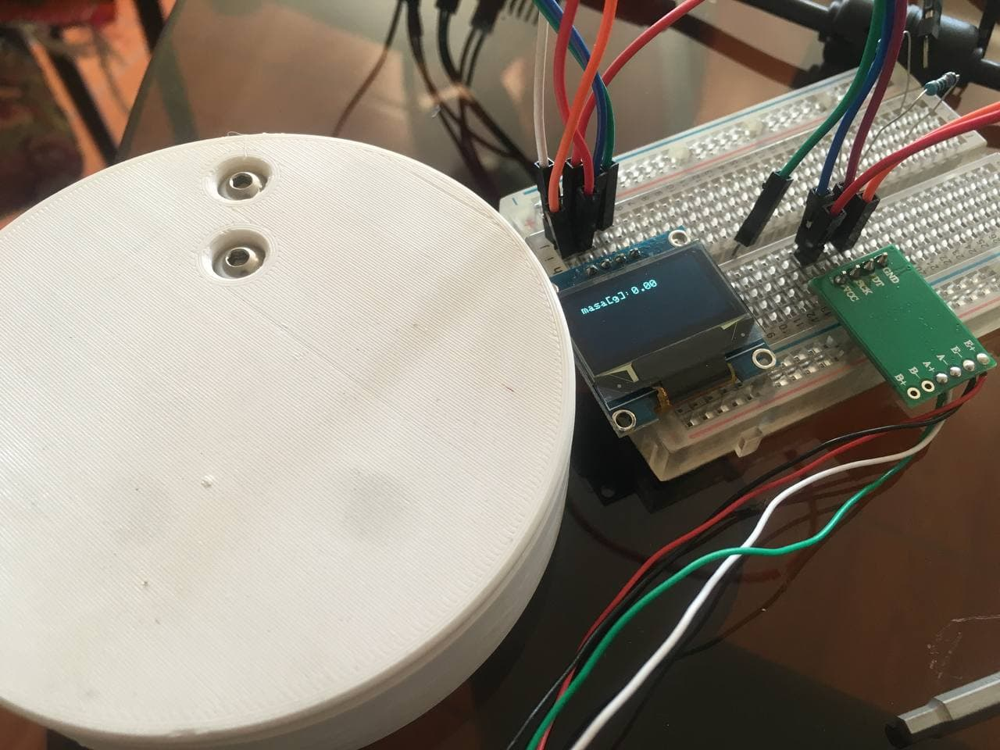

# kitchen_scale
A simple kitchen scale using HX117 amplifier and 0,96'' 128x64 SSD1306 OLED on an AVR based arduino board.

## Libraries

for the oled display you'll need the libraries
* [Adafruit SSD1306](https://github.com/adafruit/Adafruit_SSD1306)
* [Adafruit GFX](https://github.com/adafruit/Adafruit-GFX-Library)
* Wire

for the HX117 amplifier you need the library
* [HX117](https://github.com/bogde/HX711)

## CAD files

I've also designed two pieces to put the things you want to weigh on it. I've printed in PLA and it works great.

The files for printing are in the folder [cad](/cad)
